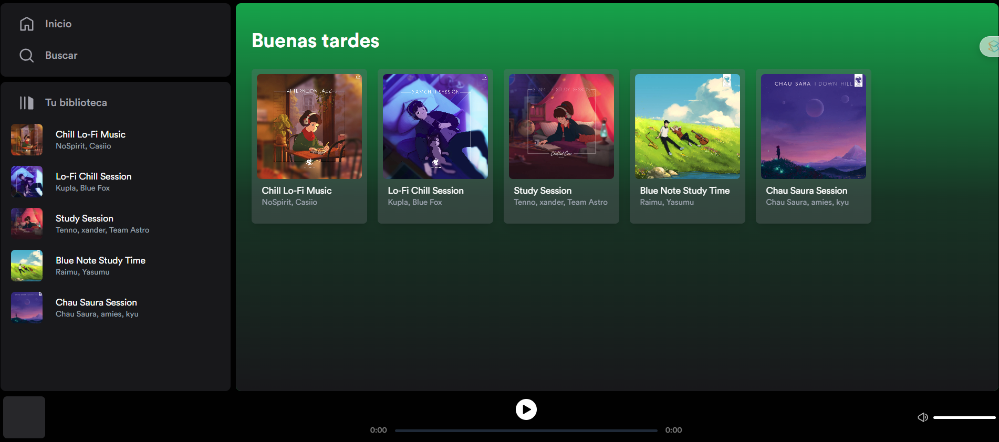

# Clone de spotify con Astro
Clone hecho con Astro, Svelte y TailwindCSS basado en el tutorial de [MIDUDEV TUTORIAL](https://www.youtube.com/watch?v=WRc8lz-bp78).
## 🖨️ Imagenes

## 🧞 Commands

Todas las instrucciones se ejecutan desde la raíz del proyecto, desde una terminal:

| Comando                   | Acción                                           |
| :------------------------ | :----------------------------------------------- |
| `npm install`             | Instala las dependencias                         |
| `npm run dev`             | Inicia el servidor local de desarrollo en `localhost:4321` |
| `npm run build`           | Construye tu sitio de producción en `./dist/`     |
| `npm run preview`         | Visualiza localmente tu construcción antes de implementar |
| `npm run astro ...`       | Ejecuta comandos de la CLI como `astro add`, `astro check` |
| `npm run astro -- --help` | Obtiene ayuda utilizando la CLI de Astro         |
